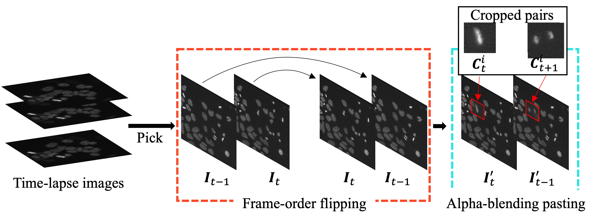

# Mitosis Detection from Partial Annotation by Dataset Generation via Frame-Order Flipping (MICCAI 2023)

## Introduction 
This is an official pytorch implementation of [Mitosis Detection from Partial Annotation by Dataset Generation via Frame-Order Flipping (MICCAI 2023)]().


## Main Results
### Results on 4 datasets

|Method         |   L    |HeLa  |ES    |ES-D  |FIb   |Ave.  |
|---------------|-------|------|------|------|------|------|
| Ours |1 annot.| 0.593|0.740|0.439|0.440|0.553|
| Ours |5 annot.| 0.795|  0.843|  0.628| 0.451 | 0.610 |
| Ours  |F|0.841|  **0.870**|  **0.648**| **0.541**| **0.725** |
| Supervised | F| **0.868**|  0.812|  0.630| 0.304 | 0.653|


# Environments
- [Ubuntu 20.04.6 LTS](https://ubuntu.com/)
- [python >= 3.6](https://www.python.org)
- NVIDIA RTX A6000

## Installation

### Conda user
```bash
conda env create -f=requirement.yml
conda activate pytorch
```

### Docker user
```bash
bash ./docker/build.sh
bash ./docker/run.sh
```

## Data preparation

[Celltracking challenge](http://celltrackingchallenge.net/2d-datasets/)

Please download training data and test data of "HeLa cells stably expressing H2b-GFP". Extract them under {ROOT_PATH}/original_data. Please rename test data file as Fluo-N2Dl-HeLa_test. Please run preprocessing code. The code normalize image based on max and mix value of whole seqence.

```bash
python ./pre_processing/ctc_preprocess.py --root_paht {ROOT_PATH}
```

```
${ROOT_PATH}
|- data
    |-- ctc_preprocessed
        |-- Fluo-N2DL-HeLa
        |   |-- 01
        |   |   |- imgs
        |   |   |  |- t000.tif
        |   |   |      :
        |   |   |  L  t091.tif
        |   |   L 01_mit.txt
        |   |
        |   L   02
        |       |- imgs
        |       |  |- t000.tif
        |       |      :
        |       |  L  t091.tif
        |       L 02_mit.txt
        L   Fluo-N2DL-HeLa_test
            |-- 01
            L   02
        
```
For the few-shot experiments and the missing experiments, please use sampling code in pre_processing folder.

## Training and Testing

Training and test script for 4-fold cross validation on 5 seed conditions (Our experiments)
```
bash ./scripts/croos_train.sh
```

Train on one condition.
```
python ./scripts/cross_train.py --img_dir ./datas/ctc_preprocessed/Fluo-N2DL-HeLa\
        --cv_num 0 --seed 0 --shot 5\
        --save_path ./outputs/${cell_type}/${method}/shot${shot}/seed${seed}/${cv_num}\
        --weight_path ./weights/${cell_type}/${method}/shot${shot}/seed${seed}/${cv_num}/best.pth\
        --dataloader CVCPLoaderBrend2
```

### Citation
If you use our code or models in your research, please cite with:
```
@inproceedings{Nishimura2023Mitosis,
  title={Mitosis Detection from Partial Annotation by Dataset Generation via Frame-Order Flipping},
  author={Nishimura, Kazuya and Katanaya, Ami and Chunma, Shinichiro and Bise, Ryoma},
  booktitle={MICCAI},
  year={2023}
}
```

